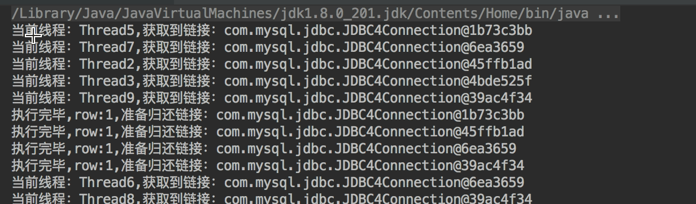
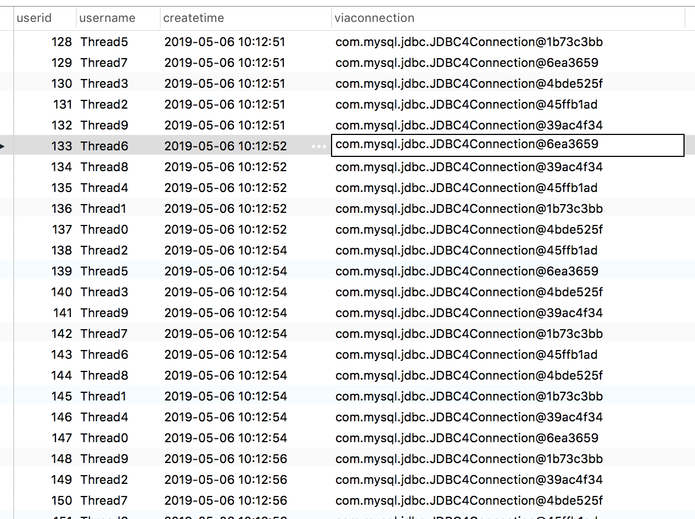
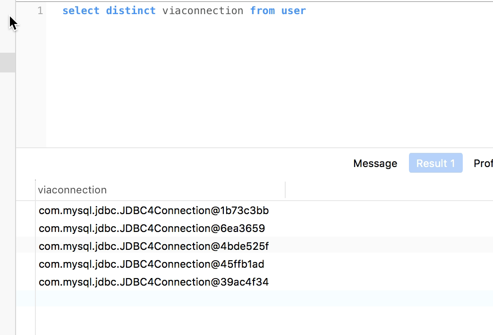

## 介绍
凡事需要共享的东西都是有成本的,不然谁乐意跟别人共享,自己独占一份多好?享元模式的出现也是为了减少系统的负载,能少创建对象就少创建,能实现共享的就共享.
## 举例
各种线程池,数据库连接池技术就是对享元模式最好的应用,我们就以数据库连接池为例,看一下实现的原理,首先我们将数据库连接信息写到配置文件中:

jdbc.url=jdbc:mysql://localhost:3306/test
jdbc.driver=com.mysql.jdbc.Driver
jdbc.username=root
jdbc.password=root

根据这个配置文件,我们可以建立一个数据库连接管理类,用来进行连接的创建和申请:

package com.crazymonkey.flyweight;

import java.io.IOException;
import java.sql.Connection;
import java.sql.DriverManager;
import java.util.Properties;

public class ConnectionManager {

        private static  String url;

        private static  String driver;

        private static  String username;

        private static String password;

        static{
            try {
                Properties properties = new Properties();
                properties.load(Object.class.getResourceAsStream("/jdbc.properties"));
                url = properties.getProperty("jdbc.url","");
                driver = properties.getProperty("jdbc.driver","");
                username = properties.getProperty("jdbc.username","");
                password = properties.getProperty("jdbc.password","");
            } catch (IOException e) {
                e.printStackTrace();
            }
        }

        //获取数据库链接
        public static Connection getConnection(){
            Connection conn = null;
            try {
                Class.forName(driver);
                conn = DriverManager.getConnection(url, username, password);
            } catch (Exception ex) {
                ex.printStackTrace();
            }
            return conn;
        }

}

这个类并没有什么可说的,就是通过jdbc进行数据库连接,对外提供一个getConnection方法获取连接,接下来是我们的线程池:


package com.crazymonkey.flyweight;

import java.sql.Connection;
import java.util.concurrent.BlockingQueue;
import java.util.concurrent.LinkedBlockingQueue;
import java.util.concurrent.TimeUnit;

public class ConnectionPool {

        //默认创建包含10个链接的连接池
        private static ConnectionPool instance = new ConnectionPool(5);

        public static ConnectionPool getInstance(){
            return instance;
        }

        BlockingQueue<Connection> pool = new LinkedBlockingQueue<>();

        public ConnectionPool(int size){
            for (int i = 0; i < size; i++) {
                pool.add(ConnectionManager.getConnection());
            }
        }

    //获取链接
    public  Connection getConnection()  {
        Connection conn = null;
        try {
            conn = pool.poll(1, TimeUnit.SECONDS);
        } catch (InterruptedException e) {
            e.printStackTrace();
        }
        return conn;
    }

        //归还链接
        public void giveBackConnection(Connection connection){
            if(connection!=null){
                pool.add(connection);
            }
        }
}

这个线程池我们采用饿汉单例来处理,线程池中维护一个默认长度是5的队列来维护创建出来的线程,提供获取连接和归还连接的方法,如果当前没有取到数据库连接,那么就等一秒,如果还没有的话就直接返回null.基本原则就是通过一个队列来共享创建出来的连接,OK,我们看一下多线程环境的调用者:

package com.crazymonkey.flyweight;

import java.sql.Connection;
import java.sql.Statement;

public class TestConnectionPool {

    public static void main(String[] args) {
        //模拟20个线程
        for (int i = 0; i < 10; i++) {
            new Thread(() -> {
                while (true) {
                    try {
                        Connection connection = ConnectionPool.getInstance().getConnection();
                        if (connection == null) {
                            System.out.println("线程已分配完，等待其他线程归还,当前线程:"+Thread.currentThread().getName());
                        } else {
                            System.out.println("当前线程："+Thread.currentThread().getName()+",获取到链接："+connection);
                            Statement stat = connection.createStatement();
                            int row = stat.executeUpdate("INSERT INTO user(username,viaconnection,createtime) VALUES('"+Thread.currentThread().getName()+"','"+connection+"',now())");
                            System.out.println("执行完毕,row:"+row+",准备归还链接："+connection);
                        }
                        ConnectionPool.getInstance().giveBackConnection(connection);
                        Thread.sleep(2000);
                    } catch (Exception e) {
                        e.printStackTrace();
                    }
                }
            }, "Thread" + i).start();

        }
    }
}

我本地的数据库有一个user表,多个线程同时向user表中添加记录,为了记录下某条记录是通过哪个connection进来的,在表中增加一个viaconection字段来标示一下,如果确实是共享的connection,那么跑完之后viaconnection字段总共最多只能有5个不同的值,Ok,我们跑一下看下结果:
输出:

数据库记录:

这些记录已经进去了,那我们看一下这些记录都是通过哪个对象进来的:

OK,我们可以看到这10个线程,共享了5个数据库连接对象
## 总结
享元模式的应用场景也比较典型,综合来讲,就是将耗资源的对象只创建若干次并通过池技术服用,减少系统的负载.

