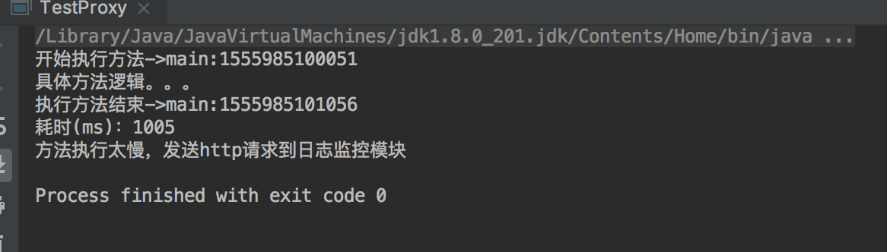
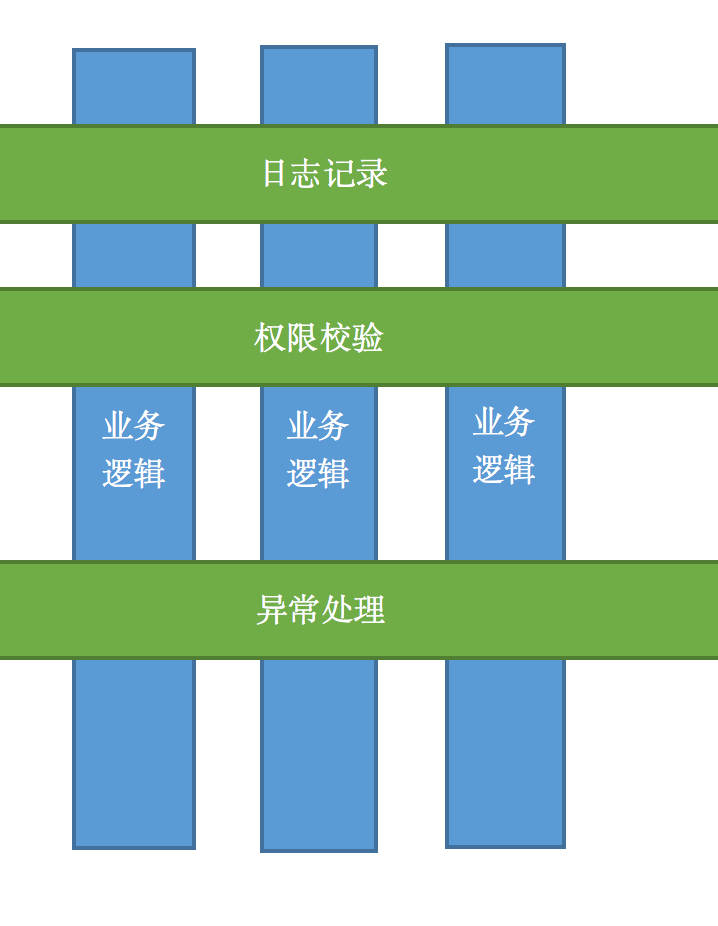

## 写在前头
这篇文章主要介绍代理模式,代理无论在生活中还是代码世界的应用都非常广泛,你点外卖,外卖小哥就是你的代理;去医院挂不着专家号,黄牛就是你的代理;做开发在调试不方便的时候经常要抓包,抓包工具就是你的代理...当我们不方便暴露自己的时候,我们可以**委托**代理类来达到我们的目的,同时如果有需要的话,代理类还可以**增强**我们的功能呢.举个例子,比如我们现在需要对所有service层的方法进行耗时统计,并汇总到日志监控模块,日志监控模块筛选出耗时长的方法,以短信或者邮件的方式通知开发负责人.
## 举例
OK,针对上面的需求,我们进行实现,有人说,打印时间么,超简单:
 
package com.crazymonkey.proxy;
public class Target {
        public void test(){
            long begin = System.currentTimeMillis();
            System.out.println("开始执行方法->main:"+begin);
            try {
                System.out.println("具体方法逻辑。。。");
                Thread.sleep(1000);
            } catch (InterruptedException e) {
                e.printStackTrace();
            } finally {
                long end = System.currentTimeMillis();
                System.out.println("执行方法结束->main:"+end);
                System.out.println("耗时(ms)："+(end-begin));
                if((end-begin)>500){
                    System.out.println("方法执行太慢，发送http请求到日志监控模块");
                }
            }
        }

}
 
 结果:
 
需求实现了,美滋滋啊.快乐是暂时的,痛苦是长久的.肉眼可见的弊端:1.一个类可以这么加,一百个类呢;2.原本方法的代码逻辑被淹没在一堆日志打印的逻辑中,如果出问题了不好排查;3.如果日志逻辑有变动,比如在打印的时候想把参数带上,这个时候假设已经修改了100个类,那是否还需要把他们再重新改一次呢.其实纠其根本,就是职责混乱.这个方法的职责就是干他原本的活,我们应该把打印日志的职责分离出来.
有人说用装饰者啊,对原来的方法进行增强,增加日志打印的功能.OK,没毛病,我们可以建立一个TargetDecorator,对test方法进行增强.但是我们今天讲的是代理,那我我们用代理模式实现一下:

package com.crazymonkey.proxy;

public class TargetProxy {

    Target target = new Target();

    public void test(){
        long begin = System.currentTimeMillis();
        System.out.println("开始执行方法->main:"+begin);
        //代理对象的实际业务方法
        target.test();

        long end = System.currentTimeMillis();
        System.out.println("执行方法结束->main:"+end);
        System.out.println("耗时(ms)："+(end-begin));
        if((end-begin)>500) {
            System.out.println("方法执行太慢，发送http请求到日志监控模块");
        }
    }
}



package com.crazymonkey.proxy;

public class Test {
    public static void main(String[] args) {
//        new Target().test();
        new TargetProxy().test();
    }
}

## 分析
这是一个最简单的代理类,TargetProxy将Target的test方法完全包裹住,使得Target类对调用者来讲是不可见的.个人认为这也是装饰者和代理的最大的区别,**装饰者强调功能的增强,代理强调功能的委托**.
再回到这个例子当中,这种简单的代理实际上并不能适用于我们的应用场景:
- Target类和代理类并没有实现统一接口,二者对外表现是不同的,没有做到面向接口编程;
- 如果我们有100个类要处理,那么我们就得生成100个代理类,虽然这些代理类功能都是相同的;
我们的需求就是在访问这100个类的方法的时候都统计一下时间,而且需要保证代码的简洁和可扩展性:动态代理了解一下.

## 动态代理
动态代理的两种方式:JDK/cglib
### JDK动态代理
首先我们需要一个业务逻辑的处理类,将计时功能封装:


package com.crazymonkey.proxy;

import java.lang.reflect.InvocationHandler;
import java.lang.reflect.Method;

public class MethodTimeProxyHandler<T>   implements InvocationHandler {

    T target;

    public MethodTimeProxyHandler(T target) {
        this.target = target;
    }

    @Override
    public Object invoke(Object proxy, Method method, Object[] args) throws Throwable {
        long begin = System.currentTimeMillis();
        System.out.println("开始执行方法->main:"+begin);

        //被代理的方法
        Object result =  method.invoke(target,args);

        long end = System.currentTimeMillis();
        System.out.println("执行方法结束->main:"+end);
        System.out.println("耗时(ms)："+(end-begin));
        if((end-begin)>500) {
            System.out.println("方法执行太慢，发送http请求到日志监控模块");
        }
        return result;
    }
}

target是被代理类,这个handler的主要功能就是拿到被代理类的对象,然后通过反射,触发被代理类的被代理方法,看下调用者


import java.lang.reflect.InvocationHandler;
import java.lang.reflect.Proxy;

public class Test {
    public static void main(String[] args) {

        //创建一个实例对象，这个对象是被代理的对象
        Target target = new Target();

        //创建一个与代理对象相关联的InvocationHandler
        InvocationHandler targetHandler = new MethodTimeProxyHandler<Target>(target);

        //创建一个代理对象targetProxy
        TargetInter targetProxy = (TargetInter) Proxy.newProxyInstance(TargetInter.class.getClassLoader(), new Class<?>[]{TargetInter.class}, targetHandler);

        //代理执行目标方法
        targetProxy.test();
    }
}


### 分析
关键的代码就是我们通过Proxy.newProxyInstance方法动态的创建了一个代理对象,并且代理对象和目标对象具有相同的行为.这样做的好处就是我们只需要把日志处理逻辑封装到统一handler中,然后通过Proxy针对不同的接口,生成不同的代理对象,传入相同的handler.这时假如我们有100个类需要处理,那么我们可以针对他们创建100个代理对象来执行同一段逻辑.之所以称之为动态代理,是因为代理对象是动态生成的,而不像静态代理或者装饰者模式一样在编译期指定.

### CGLIB动态代理
CGLIB实际上是通过修改字节码的方式来实现代理.首先我们先倒入cglib包 **<a href='cglib-nodep-3.2.5.jar' >点我获取jar包</a>**
后续操作和JDK的handler类似:

package com.crazymonkey.proxy.cglib;

import net.sf.cglib.proxy.MethodInterceptor;
import net.sf.cglib.proxy.MethodProxy;

import java.lang.reflect.Method;

public class CglibHandler<T> implements MethodInterceptor {

    T target;

    public CglibHandler(T target) {
        this.target = target;
    }

    @Override
    public Object intercept(Object o, Method method, Object[] objects, MethodProxy methodProxy) throws Throwable {

        long begin = System.currentTimeMillis();
        System.out.println("开始执行方法->main:" + begin);

        Object result = methodProxy.invoke(target, objects);

        long end = System.currentTimeMillis();
        System.out.println("执行方法结束->main:" + end);
        System.out.println("耗时(ms)：" + (end - begin));
        if ((end - begin) > 500) {
            System.out.println("方法执行太慢，发送http请求到日志监控模块");
        }
        return result;

    }
}



package com.crazymonkey.proxy.cglib;

import com.crazymonkey.proxy.Target;
import com.crazymonkey.proxy.TargetInter;
import net.sf.cglib.proxy.Enhancer;

public class Test {
    
    public static void main(String[] args) {
        Enhancer enhancer = new Enhancer();
        //回调方法
        enhancer.setCallback(new CglibHandler<Target>(new Target()));
        //设置生成类的父类类型
        enhancer.setSuperclass(TargetInter.class);
        //动态生成字节码并返回代理对象
        ((TargetInter) enhancer.create()).test();
    }
}

## 代理模式与AOP
AOP(Aspect Oriented Programming)面向切面编程,他的产生就是为了弥补面向对象编程的不足.纵观整个OO帝国,我们实际都在进行对象的纵向封装/继承,但是在这个过程中,实际上是有很多通用的功能模块的,比如上面的执行时间监控,日志记录,异常处理等等.此时就需要我们将这些模块抽象出来,并将逻辑加入不同对象的不同方法中,更职业的说法是“织入”,下面这个图可以很好的说明了为什么是面向切面:

蓝色的部分是我们的业务逻辑部分的代码,绿色的部分是代理模块.下面介绍一下Aop的基本概念:

## 扩展(JDK动态代理实现原理)

## 总结