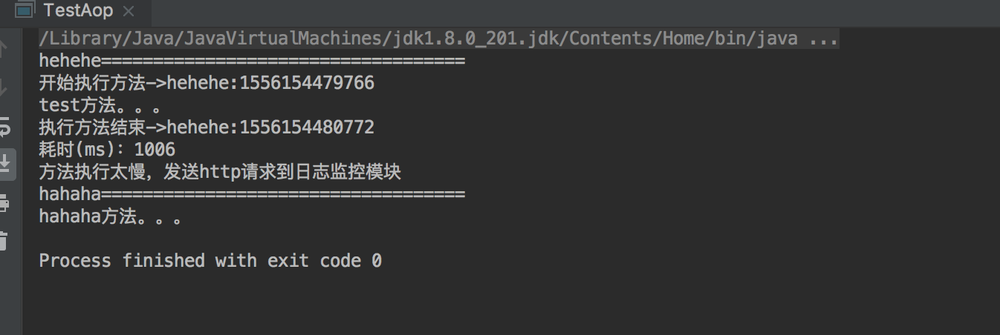

## 写在前头
这篇文章主要介绍代理模式,代理无论在生活中还是代码世界的应用都非常广泛,你点外卖,外卖小哥就是你的代理;去医院挂不着专家号,黄牛就是你的代理;做开发在调试不方便的时候经常要抓包,抓包工具就是你的代理...当我们不方便暴露自己的时候,我们可以**委托**代理类来达到我们的目的,同时如果有需要的话,代理类还可以**增强**我们的功能呢.举个例子,比如我们现在需要对所有service层的方法进行耗时统计,并汇总到日志监控模块,日志监控模块筛选出耗时长的方法,以短信或者邮件的方式通知开发负责人.
## 举例
OK,针对上面的需求,我们进行实现,有人说,打印时间么,超简单:
 
package com.crazymonkey.proxy;
public class Target {
        public void test(){
            long begin = System.currentTimeMillis();
            System.out.println("开始执行方法->main:"+begin);
            try {
                System.out.println("具体方法逻辑。。。");
                Thread.sleep(1000);
            } catch (InterruptedException e) {
                e.printStackTrace();
            } finally {
                long end = System.currentTimeMillis();
                System.out.println("执行方法结束->main:"+end);
                System.out.println("耗时(ms)："+(end-begin));
                if((end-begin)>500){
                    System.out.println("方法执行太慢，发送http请求到日志监控模块");
                }
            }
        }
}
 
 结果:
 
需求实现了,美滋滋啊.快乐是暂时的,痛苦是长久的.肉眼可见的弊端:1.一个类可以这么加,一百个类呢;2.原本方法的代码逻辑被淹没在一堆日志打印的逻辑中,如果出问题了不好排查;3.如果日志逻辑有变动,比如在打印的时候想把参数带上,这个时候假设已经修改了100个类,那是否还需要把他们再重新改一次呢.其实纠其根本,就是职责混乱.这个方法的职责就是干他原本的活,我们应该把打印日志的职责分离出来.
有人说用装饰者啊,对原来的方法进行增强,增加日志打印的功能.OK,没毛病,我们可以建立一个TargetDecorator,对test方法进行增强.但是我们今天讲的是代理,那我我们用代理模式实现一下:

package com.crazymonkey.proxy;

public class TargetProxy {

    Target target = new Target();

    public void test(){
        long begin = System.currentTimeMillis();
        System.out.println("开始执行方法->main:"+begin);
        //代理对象的实际业务方法
        target.test();

        long end = System.currentTimeMillis();
        System.out.println("执行方法结束->main:"+end);
        System.out.println("耗时(ms)："+(end-begin));
        if((end-begin)>500) {
            System.out.println("方法执行太慢，发送http请求到日志监控模块");
        }
    }
}



package com.crazymonkey.proxy;

public class Test {
    public static void main(String[] args) {
//        new Target().test();
        new TargetProxy().test();
    }
}

## 分析
这是一个最简单的代理类,TargetProxy将Target的test方法完全包裹住,使得Target类对调用者来讲是不可见的.个人认为这也是装饰者和代理的最大的区别,**装饰者强调功能的增强,代理强调功能的委托**.
再回到这个例子当中,这种简单的代理实际上并不能适用于我们的应用场景:
- Target类和代理类并没有实现统一接口,二者对外表现是不同的,没有做到面向接口编程;
- 如果我们有100个类要处理,那么我们就得生成100个代理类,虽然这些代理类功能都是相同的;
我们的需求就是在访问这100个类的方法的时候都统计一下时间,而且需要保证代码的简洁和可扩展性:动态代理了解一下.

## 动态代理
动态代理的两种方式:JDK/cglib
### JDK动态代理
首先我们需要一个业务逻辑的处理类,将计时功能封装:


package com.crazymonkey.proxy;

import java.lang.reflect.InvocationHandler;
import java.lang.reflect.Method;

public class MethodTimeProxyHandler<T>   implements InvocationHandler {

    T target;

    public MethodTimeProxyHandler(T target) {
        this.target = target;
    }

    @Override
    public Object invoke(Object proxy, Method method, Object[] args) throws Throwable {
        long begin = System.currentTimeMillis();
        System.out.println("开始执行方法->main:"+begin);

        //被代理的方法
        Object result =  method.invoke(target,args);

        long end = System.currentTimeMillis();
        System.out.println("执行方法结束->main:"+end);
        System.out.println("耗时(ms)："+(end-begin));
        if((end-begin)>500) {
            System.out.println("方法执行太慢，发送http请求到日志监控模块");
        }
        return result;
    }
}

target是被代理类,这个handler的主要功能就是拿到被代理类的对象,然后通过反射,触发被代理类的被代理方法,看下调用者


import java.lang.reflect.InvocationHandler;
import java.lang.reflect.Proxy;

public class Test {
    public static void main(String[] args) {

        //创建一个实例对象，这个对象是被代理的对象
        Target target = new Target();

        //创建一个与代理对象相关联的InvocationHandler
        InvocationHandler targetHandler = new MethodTimeProxyHandler<Target>(target);

        //创建一个代理对象targetProxy
        TargetInter targetProxy = (TargetInter) Proxy.newProxyInstance(TargetInter.class.getClassLoader(), new Class<?>[]{TargetInter.class}, targetHandler);

        //代理执行目标方法
        targetProxy.test();
    }
}


### 分析
关键的代码就是我们通过Proxy.newProxyInstance方法动态的创建了一个代理对象,并且代理对象和目标对象具有相同的行为.这样做的好处就是我们只需要把日志处理逻辑封装到统一handler中,然后通过Proxy针对不同的接口,生成不同的代理对象,传入相同的handler.这时假如我们有100个类需要处理,那么我们可以针对他们创建100个代理对象来执行同一段逻辑.之所以称之为动态代理,是因为代理对象是动态生成的,而不像静态代理或者装饰者模式一样在编译期指定.

### CGLIB动态代理
CGLIB实际上是通过修改字节码的方式来实现代理.首先我们先倒入cglib包 **<a href='cglib-nodep-3.2.5.jar' >点我获取jar包</a>**
后续操作和JDK的handler类似:

package com.crazymonkey.proxy.cglib;

import net.sf.cglib.proxy.MethodInterceptor;
import net.sf.cglib.proxy.MethodProxy;

import java.lang.reflect.Method;

public class CglibHandler<T> implements MethodInterceptor {

    T target;

    public CglibHandler(T target) {
        this.target = target;
    }

    @Override
    public Object intercept(Object o, Method method, Object[] objects, MethodProxy methodProxy) throws Throwable {

        long begin = System.currentTimeMillis();
        System.out.println("开始执行方法->main:" + begin);

        Object result = methodProxy.invoke(target, objects);

        long end = System.currentTimeMillis();
        System.out.println("执行方法结束->main:" + end);
        System.out.println("耗时(ms)：" + (end - begin));
        if ((end - begin) > 500) {
            System.out.println("方法执行太慢，发送http请求到日志监控模块");
        }
        return result;

    }
}



package com.crazymonkey.proxy.cglib;

import com.crazymonkey.proxy.Target;
import net.sf.cglib.proxy.Enhancer;

public class Test {

    public static void main(String[] args) {
        Enhancer enhancer = new Enhancer();
        //回调方法
        enhancer.setCallback(new CglibHandler<Target>(new Target()));
        //设置生成类的父类类型
        enhancer.setSuperclass(Target.class);
        //动态生成字节码并返回代理对象
        ((Target) enhancer.create()).test();
    }
}

可以看到,cglib的方式并不需要代理类和被代理类实现相同的接口.
## 代理模式与AOP
AOP(Aspect Oriented Programming)面向切面编程,他的产生就是为了弥补面向对象编程的不足.纵观整个OO帝国,我们实际都在进行对象的纵向封装/继承,但是在这个过程中,实际上是有很多通用的功能模块的,比如上面的执行时间监控,日志记录,异常处理等等.此时就需要我们将这些模块抽象出来,并将逻辑加入不同对象的不同方法中,更职业的说法是“织入”,下面这个图可以很好的说明了为什么我们把这个过程叫做横切:

我们来看下AOP的几个基本概念:
切面(Aspect):途中绿色的横条就是一个个的切面,就可以理解成一个实现特定功能的类;
连接点(Join Point):是一个泛指的概念,程序中定义的所有方法/语句块都是连接点;
切点(PointCut):一组符合某种规则的Join Point;
增强(Advice):在连接点所做的操作
目标对象(Target):连接点所属对象
织入(Weaving):将切面与连接点连接起来并生成代理的过程
简单理解一下上面的概念:切面其实很好理解,比如我们为100个类里的所有以add开头的方法增加日志记录,那么我们定义的日志记录类就相当于一个切面,这100个类的所有方法都可能是连接点,所以说是个泛指,真正的切点是我们定义的以add开头的所有方法,这就叫符合某种规则,我们也可以用正则表达式进行匹配.有了切点之后具体的业务写到advice里面,然后生成Proxy且执行就是织入的过程.按照这种理解,一个切面应该包含一个连接点和一个针对连接点的advice.
有了上面的简单的理论基础,我们来实现一个简单的Aop框架,为了简单些,就全部基于注解来做.首先我们定义我们需要的注解:

package com.crazymonkey.proxy.aop.annotation;

import java.lang.annotation.*;

@Target(ElementType.TYPE)
@Retention(RetentionPolicy.RUNTIME)
@Documented
public @interface Aspect {

}



package com.crazymonkey.proxy.aop.annotation;

import java.lang.annotation.*;

@Target(ElementType.METHOD)
@Retention(RetentionPolicy.RUNTIME)
@Documented
public @interface PointCut {

    //定义切点的匹配规则
      String pattern();
}



package com.crazymonkey.proxy.aop.annotation;

import java.lang.annotation.*;

@Target(ElementType.METHOD)
@Retention(RetentionPolicy.RUNTIME)
@Documented
public @interface Around {

    String pointcut();
}

然后我们定义一个日志切面类,来实现具体的日志功能:

package com.crazymonkey.proxy.aop;

import com.crazymonkey.proxy.aop.annotation.Around;
import com.crazymonkey.proxy.aop.annotation.Aspect;
import com.crazymonkey.proxy.aop.annotation.PointCut;

@Aspect
public class LogAspect {

    //指定切点
    @PointCut(pattern="com.crazymonkey.proxy.aop.test.Target.hehehe()")
    public void pointCut(){

    }
    //指定对切点的增强
    @Around(pointcut = "pointCut()")
    public Object doAround(JoinPoint joinPoint){
        long begin = System.currentTimeMillis();
        System.out.println("开始执行方法->"+joinPoint.getTargetMethod().getName()+":"+begin);
        Object result = null;
        try {
           result =    joinPoint.proceed();
        } catch (Throwable throwable) {
            throwable.printStackTrace();
        }
        long end = System.currentTimeMillis();
        System.out.println("执行方法结束->"+joinPoint.getTargetMethod().getName()+":"+end);
        System.out.println("耗时(ms)："+(end-begin));
        if((end-begin)>500) {
            System.out.println("方法执行太慢，发送http请求到日志监控模块");
        }
        return result;
    }
}

可以看到,一个日志切面类中包含切点和增强两部分,切点定义了我们需要拦截的方法,这里只写了一个hehehe方法,是为了我们后面逻辑简单,当然这里也可以定义正则表达式匹配.万事具备,只差代理,我们选取一个代理工厂来生成代理:

package com.crazymonkey.proxy.aop;

import com.crazymonkey.proxy.aop.annotation.Around;
import com.crazymonkey.proxy.aop.annotation.PointCut;

import java.lang.reflect.InvocationHandler;
import java.lang.reflect.Method;
import java.lang.reflect.Proxy;

public class ProxyFactory {

        public static Object getProxy(  final Object realObject, final Object aspectObject){

            final Class<?> realObjectClass = realObject.getClass();

            final Class<?> aspectObjectClass = aspectObject.getClass();

            return Proxy.newProxyInstance(

                    realObjectClass.getClassLoader(),

                    realObjectClass.getInterfaces(),

                    new InvocationHandler(){
                        @Override
                        public Object invoke(Object proxy, Method method, Object[] args) throws Throwable {
                            //获取切点信息
                            Method [] aspectMethods = aspectObjectClass.getMethods();
                            Method pointCutMethod = null;
                            //获取切点
                            for (int i = 0; i < aspectMethods.length; i++) {
                               if(aspectMethods[i].isAnnotationPresent(PointCut.class)){
                                   pointCutMethod = aspectMethods[i];
                                   break;
                               }
                            }
                            String pattern ="";
                            if(pointCutMethod!=null){
                                //获取要拦截的规则
                                  pattern =  ((PointCut) pointCutMethod.getAnnotations()[0]).pattern();
                            }
                            //获取增强
                            Method adviceMethod = null;
                            for (int i = 0; i < aspectMethods.length; i++) {
                                if(aspectMethods[i].isAnnotationPresent(Around.class)&&
                                        ((Around)aspectMethods[i].getAnnotations()[0]).pointcut().equalsIgnoreCase((pointCutMethod.getName()+"()"))){
                                    adviceMethod = aspectMethods[i];
                                    break;
                                }
                            }
                            //这里直接采用简单的contains来处理
                            if(pattern.contains(method.getName())){
                                return adviceMethod.invoke(aspectObject,new JoinPoint(method,realObject));
                            }else{
                                return method.invoke(realObject,args);
                            }

                        }

                    }
            );
        }
}



package com.crazymonkey.proxy.aop;

import java.lang.reflect.Method;

public class JoinPoint {

   Method targetMethod;

   Object targetObject;

   Object [] params;

    JoinPoint(Method targetMethod,Object targetObject){
        this.targetObject = targetObject;
        this.targetMethod=targetMethod;
        this.params = params;
    }

    Object proceed() throws Throwable {

        return this.targetMethod.invoke(targetObject,params);
    }

    public Method getTargetMethod() {
        return targetMethod;
    }

    public void setTargetMethod(Method targetMethod) {
        this.targetMethod = targetMethod;
    }

    public Object getTargetObject() {
        return targetObject;
    }

    public void setTargetObject(Object targetObject) {
        this.targetObject = targetObject;
    }

    public Object[] getParams() {
        return params;
    }

    public void setParams(Object[] params) {
        this.params = params;
    }
}


这里采用一个匿名内部类来定义handler,这个handler中最重要的逻辑就是根据我们之前定义的注解,通过反射的机制找到切面类中定义的切点和增强信息.这个handler中的内容仅供进行逻辑参考,并不能实际应用.另外我们创建了一个连接点类就是为了封装被代理对象的信息,传到around增强方法当中.至此,我们一个无敌简陋的aop框架就写好了,我们来看下调用者和调用结果:


package com.crazymonkey.proxy.aop;

import com.crazymonkey.proxy.Target;
import com.crazymonkey.proxy.TargetInter;

public class TestAop {

    public static void main(String[] args) {
        System.out.println("hehehe===================================");
        ((TargetInter) ProxyFactory.getProxy(new Target(),new LogAspect())).hehehe();

        System.out.println("hahaha===================================");
        ((TargetInter) ProxyFactory.getProxy(new Target(),new LogAspect())).hahaha();

    }
}

结果:

可以看到,我们只对配置的hehehe方法进行了织入,hahaha方法并没有被附加日志逻辑处理.在调用者的地方,我们采用了简单的new方式来创建目标对象和切面,方便说明.对于真正的SpringAop来说可以交给IOC容器托管,采用注入的方式处理.那样的话我们就可以完全不用关心切面本身,就可以采用配置的方式进行热插拔了.
## 总结
代理模式算是设计模式中比较重要且常用的一种,变体和实现方式也比较多.关键词就是委托/增强.