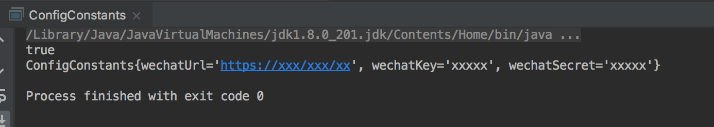
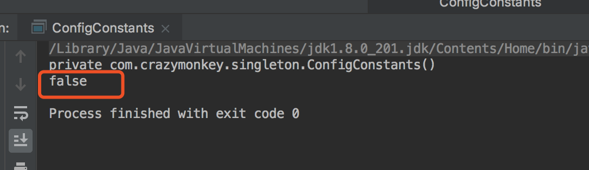

## 应用场景
顾名思义,单例就是某个类在JVM里只有一个实例对象.为什么会产生单例这种设计模式呢,个人理解,从两方面来解释,一方面是性能:假设某个类的实例非常重量,每次实例化耗时耗资源,那么我们考虑将这个实例在堆中只维护一份,比如我们的系统常常有读取配置文件的需求,那么我们完全可以只读一次就把配置文件中的内容加载进JVM以对象的形式维护,处于性能考虑,没必要每次都是实例化;另一方面是逻辑,比如数据库连接池,或者XXXManager这些管理类型的类,一个系统中有一个就够了,就好比一个房子有一个大管家就可以了,两个就容易打架,处于这种逻辑考虑,可以运用单例的设计模式来处理.
## 举例
就拿上面的读取配置文件的例子来学习一下单例模式,假设我们有一个系统,需要和微信对接,获取用户的微信头像,那么我们肯定得知道微信的服务地址吧,写死在程序里这种硬编码的方式可维护性比较差,所以我们可以考虑把微信的接口地址配到配置文件中,然后通过代码把配置读进来,实例化一个配置类:
配置文件config.properties:
 
 	#微信接口地址
 	wechatUrl = https://xxx/xxx/xxx
 	#除了url有可能会有一些其他的配置用来进行参数签名之类的
 	wechatKey = xxxxxx
 	wechatSecret = xxxxxx
 
下面我们用一个单例模式来实现上述读取配置文件的过程:
 
package com.crazymonkey.singleton;
import java.util.Properties;
/**
 * 配置文件读取类
 */
public class ConfigConstants {

    private String wechatUrl = "";

    private String wechatKey = "";

    private String wechatSecret = "";

    private static ConfigConstants instance;

    public String getWechatUrl() {
        return wechatUrl;
    }

    public String getWechatKey() {
        return wechatKey;
    }

    public String getWechatSecret() {
        return wechatSecret;
    }

    //暴露一个public类型的get方法用来获取实例信息
    public static ConfigConstants getInstance() {
        try {
            if (instance == null) {
                instance = new ConfigConstants();
            }
            return instance;
        } catch (Exception e) {
            e.printStackTrace();
            return null;
        }
    }

    @Override
    public String toString() {
        return "ConfigConstants{" +
                "wechatUrl='" + wechatUrl + '\'' +
                ", wechatKey='" + wechatKey + '\'' +
                ", wechatSecret='" + wechatSecret + '\'' +
                '}';
    }

    private ConfigConstants() throws Exception {
        Properties properties = new Properties();
        properties.load(Object.class.getResourceAsStream("/config.properties"));
        this.wechatUrl = properties.getProperty("wechatUrl", "");
        this.wechatKey = properties.getProperty("wechatKey", "");
        this.wechatSecret = properties.getProperty("wechatSecret", "");
    }

    public static void main(String[] args) {
        ConfigConstants c1 = ConfigConstants.getInstance();
        ConfigConstants c2 = ConfigConstants.getInstance();
        System.out.println(c1.equals(c2));
        System.out.println(c1.toString());
    }
}
 
 看一眼运行的结果:
 
 我们可以发现两次取得的是同一个实例,针对上面的例子我们可以总结单例的创建过程:
 1. **私有的构造方法**:防止该类在别处被实例化:
 2. **本类中定义一个static对象**:有人会问,为什么是static类型?个人理解:不考虑反射或者反序列化等特殊创建对象的方式(后面会提),我们只考虑常规的访问成员变量的方式有两种:第一种是通过new关键字创建一个对象,然后访问对象中的属性;另一种方式是直接通过类名来访问该类的静态变量,构造方法私有化之后我们无法在外部通过对象实例的方式访问该对象的成员属性,那么我们只能通过类名.方法名的方式来访问,所以就要求方法是static的,static的方法又不能直接拿非static的引用,因此必须要求成员变量instance是static的.
 3. **提供可访问该对象的公有方法**;
## 单例的写法
单例的实现有很多种方式,在这里我们只讨论**能在项目中应用的**实现方式,比如上面那个例子在多线程环境中是无法使用的,两个线程同时进入getInstance的if判断,那么就会产生两个实例.
### 懒汉模式(同步方法)
 上面我们举的例子实际上是一种懒汉的模式,之所以称之为懒汉,是因为可以做到懒加载,在使用对象实例的时候才加载,而不是在类加载的时候就加载,既然上面的例子非线程安全,那么最简单的,我们在方法上加个锁让两个线程互斥访问就可以了:
 
	public static synchronized ConfigConstants getInstance() {
        try {
            if (instance == null) {
                instance = new ConfigConstants();
            }
            return instance;
        } catch (Exception e) {
            e.printStackTrace();
            return null;
        }
    }
  
上面这种锁方法的做法效率不高(其实只有第一次实例化的时候需要加锁,以后直接取就可以了,但是将整个方法进行同步就意味着每次获取实例都需要互斥访问),所以常用的是一种双重检查的方式:
### 懒汉模式(Double-Check)
 
 	private volatile static ConfigConstants instance;
    public static ConfigConstants getInstance() {
        try {
            if (instance == null) {
                synchronized (ConfigConstants.class) {
                    if (instance == null) {
                        instance = new ConfigConstants();
                    }
                }
            }
            return instance;
        } catch (Exception e) {
            e.printStackTrace();
            return null;
        }
    }
  
AB两个线程同时进入if判断,假设A获得锁之后进入第二个if判断,这时候发现instance为空,遂创建一个instance实例,当A获得锁的时候B只能等待锁,当A完成了实例化的过程,释放了锁,此时B获得锁,经过if判断,发现已经有实例了,所以就不会再创建实例,实际上这种方式和同步方法相比是更细粒度的串行化.
和普通的懒汉模式相比还有一点小差别,就是我们的实例变量采用了volatile修饰,这是为了避免**DCL失效**的问题,简单解释一下:
JVM的内存模型是主存和线程内存,每个线程在工作的时候先从主存copy一份数据到自己的工作内存,实例化的过程实际就是1.分配空间,2.构造对象,3.将引用指向对象的过程,搞完了再把这个对象的引用刷到主存中去,然后另一个线程就能看到了.逻辑没问题,但实现上会复杂一些,java编译器的指令优化加上底层cpu的并行调整,有可能造成上述三个步骤并行执行,比如先为对象分配空间,然后指针指向该内存空间,然后再构造对象,这样对象构造一半,又把instance引用刷到主存中去了,这时候底层cpu时间片切换,线程B拿到了时间片进入if条件,发现主存中的instance非空了,所以直接返回实例,这时候拿到的是堆中的一个半成品对象,在操作这个对象的时候就会出问题.整个现象就叫DCL失效,为了解决这个问题我们将引用声明成volatile,这个关键字除了内存即时可见以外还会禁止底层的指令重排,那么在线程B拿到对象的时候可以保证是完整的.如果想深入了解,可以看一下java的内存模型,和多线程相关的东西.
### 饿汉模式
饿汉模式和懒汉模式对比来说,就是类在初始化的时候就加载其中的对象,这时JVM的类加载机制保证了单线程的操作,因此我们不用加任何锁就可以保证线程安全,饿汉模式可以利用静态变量或者静态代码块来实现:

package com.crazymonkey.singleton;
import java.io.IOException;
import java.util.Properties;

/**
 * 配置文件读取类
 */
public class ConfigConstants {

    private String wechatUrl = "";

    private String wechatKey = "";

    private String wechatSecret = "";

    private static ConfigConstants instance = new ConfigConstants();

//注释的部分采用static代码块加载,和上面的采用静态变量的方式效果一样
//    private static ConfigConstants instance;
//
//    static{
//        instance = new ConfigConstants();
//    }
    public static ConfigConstants getInstance() {
       return instance;
    }
    @Override
    public String toString() {
        return "ConfigConstants{" +
                "wechatUrl='" + wechatUrl + '\'' +
                ", wechatKey='" + wechatKey + '\'' +
                ", wechatSecret='" + wechatSecret + '\'' +
                '}';
    }
    private ConfigConstants()  {
        try {
            Properties properties = new Properties();
            properties.load(Object.class.getResourceAsStream("/config.properties"));
            this.wechatUrl = properties.getProperty("wechatUrl", "");
            this.wechatKey = properties.getProperty("wechatKey", "");
            this.wechatSecret = properties.getProperty("wechatSecret", "");
        } catch (IOException e) {
            e.printStackTrace();
        }
    }
    public static void main(String[] args) {
        ConfigConstants c1 = ConfigConstants.getInstance();
        ConfigConstants c2 = ConfigConstants.getInstance();
        System.out.println(c1.equals(c2));
        System.out.println(c1.toString());
    }
}
 
### 内部类
只列出关键代码,构造方法之类的可以看上面

    //定义静态内部类
    private static class ConfigConstantsHolder{
        private static final ConfigConstants instance = new ConfigConstants();

    }

    public static ConfigConstants getInstance() {
        return ConfigConstantsHolder.instance;
    }
 
静态内部类和饿汉模式一样,也是利用了虚拟机的类加载机制来保证单例的,但是和饿汉模式不同,在外部类ConfigConstants加载的时候并不会加载内部类,而是在调用getInstance的时候去取ConfigConstantsHolder的成员变量的时候才被初始化,此时instance实例才真正被创建出来,因此我们也可以认为是懒加载的一种.
### 枚举类

package com.crazymonkey.singleton;

import java.io.IOException;
import java.util.Properties;

public enum ConfigEnum {
    INSTANCE;

    private String wechatUrl="";
    private String wechatKey="";
    private String wechatSecret = "";

    ConfigEnum(){

        try {
            Properties properties = new Properties();
            properties.load(Object.class.getResourceAsStream("/config.properties"));
            this.wechatUrl = properties.getProperty("wechatUrl", "");
            this.wechatKey = properties.getProperty("wechatKey", "");
            this.wechatSecret = properties.getProperty("wechatSecret", "");
        } catch (IOException e) {
            e.printStackTrace();
        }
    }
    @Override
    public String toString() {
        return "ConfigEnum{" +
                "wechatUrl='" + wechatUrl + '\'' +
                ", wechatKey='" + wechatKey + '\'' +
                ", wechatSecret='" + wechatSecret + '\'' +
                '}';
    }
    public static void main(String[] args) {
        System.out.println( ConfigEnum.INSTANCE== ConfigEnum.INSTANCE);
        System.out.println(ConfigEnum.INSTANCE);
    }
}

枚举类本身就是单例,我们可以利用这个特性实现我们单例的应用场景.
## 单例的破坏
我们上面讨论的单例的构造过程中有很重要的一点,就是构造方法私有,那么我们把构造方法藏起来了,别人就会老老实实调用我们的getInstance方法么,毕竟除了new java还提供了其他的生成对象的方式,比如下面这两种:
### 反射

   public static void main(String[] args) {
        ConfigConstants c1 = ConfigConstants.getInstance();
        Constructor[] constructors = ConfigConstants.class.getDeclaredConstructors();
        if(constructors.length>0){
            try {
                System.out.println(constructors[0]);
                ConfigConstants c2 = (ConfigConstants)(constructors[0].newInstance(null));
                System.out.println(c1.equals(c2));
            } catch (InstantiationException e) {
                e.printStackTrace();
            } catch (IllegalAccessException e) {
                e.printStackTrace();
            } catch (InvocationTargetException e) {
                e.printStackTrace();
            }
        }
    }

看一眼结果,通过单例生成的对象和我们通过getInstance方法生成的对象不是一个:

解决方法就是增加标志位,第一次创建的时候将标志位置true,在构造方法中进行判断,代码不贴了,可以按这种思路自己实现
### 反序列化


    public static void main(String[] args) {
        try {
            ObjectOutputStream oos=new ObjectOutputStream(new FileOutputStream("/Users/yangsimeng/Documents/test/test.obj"));
            oos.writeObject(ConfigConstants.getInstance());
            //Read Obj from file
            File file=new File("/Users/yangsimeng/Documents/test/test.obj");
            ObjectInputStream ois=new ObjectInputStream(new FileInputStream(file));
            ConfigConstants newInstance=(ConfigConstants)ois.readObject();
            //判断是否是同一个对象
            System.out.println(newInstance==ConfigConstants.getInstance());
        } catch (IOException e) {
            e.printStackTrace();
        } catch (ClassNotFoundException e) {
            e.printStackTrace();
        }

    }

如果单例类实现了serializble接口,那么是可以被序列化的,如果序列化之后再反序列化,那么将会生成不同的对象,解决方式就是不让他序列化或者定义readResolve方法返回指定的对象即可:

    private Object readResolve(){
        return instance;
    }


