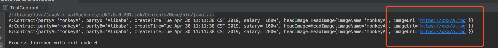
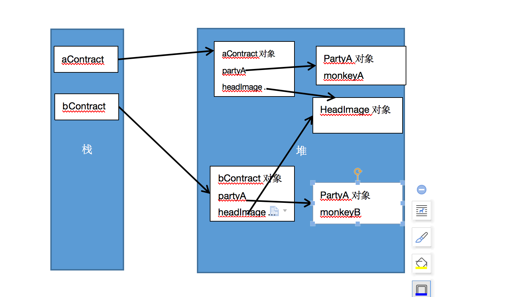

## 介绍
说到原型模式,我们首先想到的可能是Object类提供的clone方法,我们通过这个方法来实现对象的复制,对象为什么要通过复制的方式来创建呢?首先,如果一个对象的构造过程比较复杂或者构造成本比较高(比如设计磁盘io/数据库读写),我们可以考虑只创建一次,如果是配置型的且和具体的业务状态无关,我们可以考虑采用前面提到过的单例的模式来维护,但是如果和具体业务实体相关的,那么我们就可以采用clone的方式创建对象;另外,如果我们需要的是很多相似的对象,他们仅有几个属性不同,我们也可以采用原型模式先复制大部分属性,然后针对不同的属性赋值即可.
## 举例
光说不形象哈,举个例子,我们找工作入职都需要签合同,如果我们来设计一个合同系统的话,那么必不可少的需要设计一个Contract实体:

package com.crazymonkey.prototype;

import java.util.Date;

//合同类
public class Contract {
    //甲方
    String partyA;
    //乙方
    String partyB;
    //签订时间
    Date createTime;
    //工资
    String salary;

}

只是简单挑选了几个属性进行模拟,其实一份合同的属性很多,但是大部分都是所有人都一样的,只有甲方的名字啊,身份证号啊,工资啊什么的不相同,如果做这个合同管理系统的时候我们每次都调用构造方法new一个对象,那么就需要把所有那些固定信息都重填一遍,很麻烦的,是你你也不愿意这么干.最简单的方式,我预先初始化好一份合同模板,来一个人复制一份不就得了,jdk给我们提供了Cloneable接口来标识一个对象能否被克隆,那我么的合同类变成了这样:

package com.crazymonkey.prototype;

import java.util.Date;

//合同类
public class Contract implements Cloneable {
    //甲方
    String partyA;
    //乙方
    String partyB;
    //签订时间
    Date createTime;
    //工资
    String salary;
    //头像
    HeadImage headImage;

    public Contract(String partyA, String partyB, Date createTime, String salary,HeadImage headImage) {
        this.partyA = partyA;
        this.partyB = partyB;
        this.createTime = createTime;
        this.salary = salary;
        this.headImage = headImage;
    }

    protected Contract clone() throws CloneNotSupportedException {
        return (Contract)super.clone();
    }

    @Override
    public String toString() {
        return "Contract{" +
                "partyA='" + partyA + '\'' +
                ", partyB='" + partyB + '\'' +
                ", createTime=" + createTime +
                ", salary='" + salary + '\'' +
                ", headImage=" + headImage +
                '}';
    }
}

其中有个头像类HeadImage用来存储员工的头像:

package com.crazymonkey.prototype;

public class HeadImage {

    String imageName="";

    String imageUrl = "";

    public HeadImage(String imageName, String imageUrl) {
        this.imageName = imageName;
        this.imageUrl = imageUrl;
    }

    @Override
    public String toString() {
        return "HeadImage{" +
                "imageName='" + imageName + '\'' +
                ", imageUrl='" + imageUrl + '\'' +
                '}';
    }
}

调用的地方也比较简单,我们复制之后只需要修改特有属性就可以了,不需要关注其他的共有属性:

package com.crazymonkey.prototype;

import java.util.Date;

public class TestContract {

    public static void main(String[] args) {
      Contract aContract =   new Contract("monkeyA","Alibaba",new Date(),"100w",new HeadImage("monkeyA","https://xxx/a.jpg"));
        System.out.println("A:"+aContract);
        try {
            Contract bContract = aContract.clone();
            bContract.partyA="monkeyB";
            bContract.salary="200w";
            bContract.headImage.imageUrl="https://xxx/b.jpg";
            System.out.println("A:"+aContract);
            System.out.println("B:"+bContract);

        } catch (Exception e) {
            e.printStackTrace();
        }
    }
}

看下运行结果:

啊呀,发现了点问题啊,我们采用直接修改克隆对象属性的这种方式不靠谱啊,本来想改b的头像路径,结果把a对象的也改了,这说明啥呢,说明这俩的headimage是一个东西.这就是我们常说的浅拷贝.
## 浅拷贝与深拷贝
个人理解,浅拷贝的过程中,基本数据类型不是公用的,但是引用类型是公用的.画个图:

虽然A和B是两个不同的对象,但是A的成员和B的成员引用指向相同的堆内地址,不信可以自己做实验啊,用==判断一下地址是否相同,这种就是浅拷贝.那相对的,深拷贝就很好理解了,就是每个对象拥有独立的属性值的地址,这个就不画图了.那我们怎么实现深拷贝呢,这个方式就比较多了,所有可以生成独立堆内空间的操作,都可以实现,比如序列化/new 一个新的对象,等等,只要不用原来的成员属性对象就可以了
## 总结
原型模式的应用场景也比较典型,用在需要频繁创建对象,或者对象构造过程中比较耗资源的场景中,让我们可以通过拷贝的方式快速的创建对象,维护原对象的只读等等.
