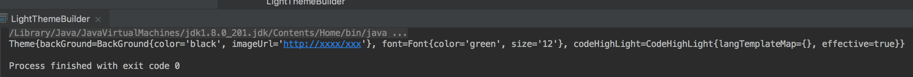

## 应用场景
建造者,是构建对象的时候用的一种设计模式,有的人说,构建对象直接new就可以了,怎么还有设计模式呢.如果一个类的结构比较简单,那么我们可以直接new创建对象,但是如果考虑一些构造方法的变化和业务的扩展,就会体现出建造者模式的优点.
## 举例1
我们在工作中肯定会遇到分页查询的场景,由于返回的数据结构固定,因此我们可以定义一个分页类来进行封装:

package com.crazymonkey.builder;

import java.util.List;
public class Pagination<T> {

    //当前页
    private int currentPage;
    //每页条数
    private int pageSize;
    //总条数
    private int totalLines;
    //总页数
    private int totalPages;
    //数据信息
    List<T> data;

    //忽略getters and setters
}
 

我们在使用分页的时候就直接构造呗

 	//内部类,用来模拟从数据库中查出来的实体
  private class User{
        private String userId;
        private String userName;

    }
    public static void main(String[] args) {
    	//分页的使用 重点关注下这里
        List<Pagination.User> users = new ArrayList<>();
        Pagination page = new Pagination<>();
        page.setCurrentPage(0);
        page.setPageSize(10);
        page.setTotalLines(100);
        page.setTotalPages(10);
        page.setData(new ArrayList<Pagination.User>());
    }
 
## 分析
我们还是从设计原则来分析一下,main方法作为调用者来讲,他的目的就是为了获取一个pagination对象,在这个过程中他其实不需要关注对象的**构造细节**,什么是构造细节,就是对象包含什么属性,到底是怎么赋值的.有人说,那好办啊,java的三大特性之首,封装,我们把实现细节封起来不就得了么,怎么封呢---最简单的方式:构造方法呗,

	//构造方法
  Pagination(int currentPage,int pageSize,int totalLines,int totalPages,List<T> data){
        this.currentPage = currentPage;
        this.pageSize = pageSize;
        this.totalLines = totalLines;
        this.totalPages = totalPages;
        this.data = data;
    }
    //具体调用
    public static void main(String[] args) {
        List<Pagination.User> users = new ArrayList<>();
        Pagination page = new Pagination<>(0,10,100,10,new ArrayList<Pagination.User>());
    }

调用的地方变成了一行,美滋滋,但是突然有个需求,返回的分页实体中要扩展一个type字段,用来标示前端要用哪种展示方式(不讨论需求合理性,只进行简单扩展)我们就需要修改构造方法,或者重载构造方法.每次需求变更都要重新修改构造方法,并修改调用者的代码,如果参数很多的情况下构造函数也会显得杂乱且不好维护
## 应用
所以我们考虑引入建造者类来帮我们处理构造过程:

	//引入静态内部类(如果定义成外部类也一样,体会思想即可)
    private static class Builder{

        private Pagination pagination;

        public Builder(Pagination p){this.pagination = p;}
        public Builder buildCurrentPage(int currentPage){
            this.pagination.currentPage=currentPage;
            return this;
        }
        public Builder buildPageSize(int pageSize){
            this.pagination.pageSize=pageSize;
            return this;
        }
        public Builder buildTotalLines(int totalLines){
            this.pagination.totalLines=totalLines;
            return this;
        }
        public Builder buildTotalPages(int totalPages){
            this.pagination.totalPages=totalPages;
            return this;
        }
        public Builder buildData(List data){
            this.pagination.data=data;
            return this;
        }
        public Pagination build(){
            return this.pagination;
        }
    }
    //具体调用
    public static void main(String[] args) {
        Pagination page = new Pagination.Builder(new Pagination()).buildCurrentPage(0).buildPageSize(10).buildTotalLines(100).build();
    }

## 分析
从上面的调用过程我们可以看到,如果此时增加需求,并不需要重载构造方法,只需要修改建造者类就可以了.这样修改的话有两点好处,一是逻辑比较清晰,客户端-->建造者-->对象,将建造的职责抽离出来;二是这种类似于流式的编程方式让我感觉很爽,简洁.但是从根本上来看,调用者实际上仍然参与了具体对象的构造细节,如果需求扩展的话,我们仍然需要修改调用者的调用代码.我们可以说这是建造者的一种应用场景,能帮我们实现一种流式编程方式,但是从面向对象的角度来讲,这种应用场景下的建造者模式对于代码架构来讲,并没有实质上的提升.
## 举例2
个人理解:**建造者模式更适合对象的组成相对固定,构建流程相对固定,但表现不固定的情况**  举个例子来讲,我们用的很多软件并非大而全,真正厉害的是他们的插件,各种各样的插件提供丰富的功能,比如zsh/sublime/eclipse/idea,老外的设计思想很多就是**面向接口编程**,我只提供标准,那么基于这个标准我可以进行各种扩展.我们就举一个最简单的主题插件的例子,用idea或eclipse的都知道可以换主题,github上也有大量的主题配置文件,假如让我们来设计这种换主题的操作,我们怎么搞:
### 第一步 抽象概念
主题包括啥?背景(颜色,图片,...)/字体(颜色,字号,字体...)/代码高亮(语言,模板,...)/动态效果(...)

package com.crazymonkey.builder;

/**
 * 主题类,是我们要构造的最终对象 包含上面提到的实体
 */
public class Theme {

package com.crazymonkey.builder;
/**
 * 主题类,是我们要构造的最终对象
 */
public class Theme {
    //背景
    private BackGround backGround;
    //字体
    private Font font;
    //代码高亮
    private CodeHighLight codeHighLight;

    public BackGround getBackGround() {
        return backGround;
    }
    public void setBackGround(BackGround backGround) {
        this.backGround = backGround;
    }
    public Font getFont() {
        return font;
    }
    public void setFont(Font font) {
        this.font = font;
    }
    public CodeHighLight getCodeHighLight() {
        return codeHighLight;
    }
    public void setCodeHighLight(CodeHighLight codeHighLight) {
        this.codeHighLight = codeHighLight;
    }
}



package com.crazymonkey.builder;

public class BackGround {

    //背景颜色
    private String color;
    //背景图片地址
    private String imageUrl;

    public String getColor() {
        return color;
    }

    public void setColor(String color) {
        this.color = color;
    }

    public String getImageUrl() {
        return imageUrl;
    }

    public void setImageUrl(String imageUrl) {
        this.imageUrl = imageUrl;
    }
}



package com.crazymonkey.builder;

public class Font {
    //字体颜色
    private String color;
    //字号
    private String size;

    public String getColor() {
        return color;
    }

    public void setColor(String color) {
        this.color = color;
    }

    public String getSize() {
        return size;
    }

    public void setSize(String size) {
        this.size = size;
    }
}




package com.crazymonkey.builder;

import java.util.Map;

public class CodeHighLight {
    //语言对应的模版id
    private Map<String,String> langTemplateMap;

    //是否开启代码高亮
    private boolean effective;

    public Map<String, String> getLangTemplateMap() {
        return langTemplateMap;
    }

    public void setLangTemplateMap(Map<String, String> langTemplateMap) {
        this.langTemplateMap = langTemplateMap;
    }

    public boolean isEffective() {
        return effective;
    }

    public void setEffective(boolean effective) {
        this.effective = effective;
    }
}

### 开始构造
我们已经有了基础的数据结构和简单的构成关系,现在我们想创建一个Theme类怎么搞呢,如果你还说new一个Theme对象,然后一个一个set属性,那么请面壁十分钟.我们在整个关系体系中抽象出一个建造者的概念用来实现Theme对象的构造:

	package com.crazymonkey.builder;

	public interface ThemeBuilder {

	    void buildBackGround();

	    void buildFont();

	    void buildCodeHighLight();

	    Theme build();
	}


OK 假设我是Idea的开发者我的工作就做完了,我就定义一个接口,给你提供约束,告诉你们一个主题都有哪些组成部分,最终要构建成个什么样子,具体你们想开发成啥样就啥样呗,比如我们按照上面的约定,实现一个亮色主题:

	package com.crazymonkey.builder;

	import java.util.HashMap;

	public class LightThemeBuilder implements  ThemeBuilder {

	    Theme theme;

	    LightThemeBuilder(Theme theme){
	        this.theme =  theme;
	    }
	    @Override
	    public void buildBackGround() {
	        BackGround bg = new BackGround();
	        bg.setColor("black");
	        bg.setImageUrl("http://xxxx/xxx");
	        theme.setBackGround(bg);
	    }

	    @Override
	    public void buildFont() {
	        Font font = new Font();
	        font.setColor("green");
	        font.setSize("12");
	        theme.setFont(font);
	    }

	    @Override
	    public void buildCodeHighLight() {
	        CodeHighLight chl = new CodeHighLight();
	        chl.setEffective(true);
	        chl.setLangTemplateMap(new HashMap<>());
	        theme.setCodeHighLight(chl);
	    }

	    @Override
	    public Theme build() {
	        return theme;
	    }
	}

在这里演示的只是简单的new一个背景对象,字体对象什么的,其实对象的各种属性值完全可以从配置文件读取啊,从数据库读取啊,然后你再把你需要的配置文件什么的和你的代码打个包,放到人家指定的位置,一个主题插件不就完成了么.我们看下调用者:

    public static void main(String[] args) {
        ThemeBuilder tb = new LightThemeBuilder(new Theme());
        tb.buildBackGround();
        tb.buildCodeHighLight();
        tb.buildFont();
        Theme theme = tb.build();
        System.out.println(theme);
    }

### 分析
其实我们实际上是用一个继承关系来屏蔽了Theme对象的具体构造细节,我们只需要告诉具体建造者,给我造背景,但是不需要指定造什么样的背景,实际上是将构造Theme对象的职责抽象到各种水平扩展的构造者身上,但是作为调用者来讲,我们最终只获取Theme对象,并不关心是怎么造出来的,所以我们引入一个指挥官的概念.
### 指挥官

	package com.crazymonkey.builder;

	public class ThemeBuildDirector {

	    ThemeBuilder tb;

	    ThemeBuildDirector(ThemeBuilder tb){
	        this.tb = tb;
	    }

	    public Theme direct(){
	        tb.buildFont();
	        tb.buildCodeHighLight();
	        tb.buildBackGround();
	        return tb.build();
	    }
	}

这时候,调用者只需要告诉指挥官,我需要一个什么样的Theme,那么指挥官就会调用具体的建造者去造了,而且调用者完全不需要关注对象的建造细节,也不用担心造的部件不完整,这一切都是由指挥官管辖,如果增加需求的话,也不会影响调用者的逻辑,而是由指挥官进行具体建造任务的协调.

 public static void main(String[] args) {
        Theme theme = new ThemeBuildDirector(new LightThemeBuilder(new Theme())).direct();
        System.out.println(theme);
    }

看一眼结果:

看完这个例子再看我前面说的那句话,就不难理解了,一个Theme组成部分相对固定,字体啊,背景啊什么的,并且建造流程相对固定,就是造那几部分内容呗,但是表现不固定,什么是表现,就是不同Theme对象的业务形态:白的,黑的,绿的.这种情况我们用建造者可以做到很好的扩展和动态替换.

## 总结
上面的两个例子实际上是建造者的两种不同的应用场景,我们通过用这种设计模式来达成特定的效果,其实所有设计模式都是一样,有的时候我们可能只需要用到其中的一部分思想就可以了,没必要生搬硬套,掌握设计模式的原则即可.我们再回头看下设计模式的那几项原则,理解一下再建造者模式上的体现,思考一下是怎么一步步封装职责,做到动态替换的,相信你会对设计思想有更深层次的理解.

