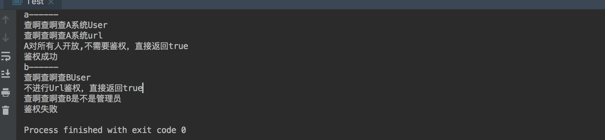

## 例行闲扯
模板方法模式比较简单,是解释面向抽象编程一个很好的例子,模版方法的应用场景实际上就四个字**流程提取**.比如我们发工资->请老婆吃饭->上交工资,这就是一个很典型的流程.至于你发了多少,吃的什么,上交时候痛苦或快乐,都是实现.对于关注流程的应用场景来讲,我们并不关心实现.
## 举例
上面发工资那个例子还挺好的,如果学会了模版模式的话可以试着写一下.我们举一个更通用的例子,比如http接口、在访问数据的时候都需要对登录的人进行权限的校验,大部分是基于session的.我们假定校验分三步:身份校验->接口地址校验->权限校验.ok了,我们在不知不觉中就抽象出了一个鉴权流程,和上面那个工资流程是一样一样的.有的同学说,抽象这个流程有啥用么,我直接写三个方法去调用查数据库不就得了么,OK 单体应用没毛病,但是如果你有多个服务都需要鉴权呢,每个服务又有自己的鉴权方式呢,每一个都写三个方法么?**做抽象,是为了更好的复用**.
## 上代码
 
package com.crazymonkey.template;

public abstract  class AuthController {

    abstract boolean isUserLegal();

    abstract boolean isUrlLegal();

    abstract boolean isUserAuthenticated();

    public void auth(Request request){

        if(isUserLegal()&&isUrlLegal()&&isUserAuthenticated()){
            System.out.println("鉴权成功");
        }else{
            System.out.println("鉴权失败");
        }
    }

    //模拟接口过来的请求对象
    class Request{
        String userId;

        String sessionId;

        String requestUrl;

    }
}
 
 AuthContrller模拟请求处理类,注意:他的三个鉴权方法全部都是抽象的,只提供了一个具体的鉴权入口auth方法,现在代码写好了,领导规定,所有系统全部都要接入这个鉴权模块,走一样的流程,OK 来看个实现:

package com.crazymonkey.template;

public class SystemAController extends AuthController {
    @Override
    boolean isUserLegal(String userId) {
        System.out.println("查啊查啊查A系统User");
        return true;
    }

    @Override
    boolean isUrlLegal(String url) {
        System.out.println("查啊查啊查A系统url");
        return true;
    }

    @Override
    boolean isUserAuthenticated(String userId) {
        System.out.println("A对所有人开放,不需要鉴权，直接返回true");
        return true;
    }

}



package com.crazymonkey.template;

public class SystemBController extends AuthController{

    @Override
    boolean isUserLegal(String userId) {
        System.out.println("查啊查啊查BUser");
        return true;
    }

    @Override
    boolean isUrlLegal(String url) {
        System.out.println("不进行Url鉴权，直接返回true");
        return true;
    }

    @Override
    boolean isUserAuthenticated(String userId) {
        System.out.println("查啊查啊查B是不是管理员");
        return false;
    }
}

我们写个main方法来模拟一下请求:

package com.crazymonkey.template;

public class Test {

    public static void main(String[] args) {
        AuthController.Request request =  new AuthController.Request("111","/test/info");
        System.out.println("a------");
        new SystemAController().auth(request);
        System.out.println("b------");
        new SystemBController().auth(request);

    }
}

来看下结果

很明显吧,针对同一条流程A和B系统分别提供了自己的实现,如果我们是maven工程,那么我们可以把代码放在common底下,提供流程上的约束,让大家都提供实现,面向抽象编程就是好啊,我只提供约束,你们还都得听我的,美滋滋.
## 扩展
假如这个时候领导又说了,我们要把访问信息写到日志里记录一下子,但是只有部分系统才需要.当然你可以去改造ABC...各种系统啊,用什么日志框架啊什么的,但是我们想下,日志记录实际上是通用流程的一部分,只不过呢,有的系统不需要,说明此时子流程和父流程已经不是完全贴合的关系了,**子流程如果对父流程产生影响的时候,我们考虑用钩子函数**


    //定义获取日志级别的方法 -1 不打日志  1 打日志
    protected  int logLevel(){return 1;}

    public void auth(Request request){
        //注意这里
        if(this.logLevel()==1){
            System.out.println("我是日志");
        }
        if(isUserLegal(request.userId)&&isUrlLegal(request.requestUrl)&&isUserAuthenticated(request.userId)){
            System.out.println("鉴权成功");
        }else{
            System.out.println("鉴权失败");
        }
    }

只看关键的部分,我们定义了一个logLevel的方法,用来控制日志的输出,默认是输出的,此时如果系统A不想输出日志怎么办呢:很简单,你重写logLevel方法不就得了么,毕竟运行时this指向的是子类对象.看到这我们就明白了,整个模版方法的核心,又回到了最初的概念,父类引用指向子类对象是什么呢?多态!
哦,解释一下钩子,个人理解,这里的钩子就跟后门差不多,如果子流程想对父流程实现修改,那么就可以通过父流程留的这个后门操作.比如本例,loglevel就是子类钩住父类的一个钩子,带绳的那种,钩上之后可以顺着绳子爬到父类上搞点事情.
