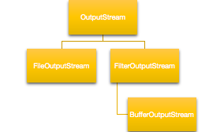

## 前言
在面向对象的设计当中,我们认为成员变量是对象的属性,方法是对象的行为,比如我们新建一个Cat类,且实例化一个对象出来,那么颜色/体重/...这些属性我们可以作为成员变量,跑/叫/散步...我们将这些动态行为抽象成方法.如果当前类的设计无法满足需求,我们需要对现有类的行为进行增强,有几种途径:1.直接修改2.继承并重写3.装饰者4.其他 直接修改实际上违反了开闭原则,况且并非所有的时候都可以对源码进行直接修改,继承实际上是获取父类的所有非privage行为,而且java是单继承,这种方式显得不够灵活.装饰者模式实际上就是为了灵活的解决类的行为增强这一类问题.网上博客说的最多的装饰者的应用就是IO流,那么我们就以IO流为例子,解释一下装饰者的应用.
## 举例
比如我们将一段文本写入txt文档当中:

package com.crazymonkey.decorator;
import java.io.*;

public class TestStream {
    public static void main(String[] args) {
        String str = "I am a Stream Decorator Test";
        String filePath = "/Users/yangsimeng/Documents/test/teststream.txt";
        try {
            OutputStream os  = new FileOutputStream(filePath) ;
            os.write(str.getBytes());
        } catch (FileNotFoundException e) {
            e.printStackTrace();
        } catch (IOException e) {
            e.printStackTrace();
        }

    }
}
 
 当我的文本比较长的时候,不想每次都往硬盘上写,这时候就可以写一部分到内存缓冲区中,缓冲区满了再统一写入硬盘.这种情况实际上就是对原用功能的增强,这时候我们考虑BufferedInputStream:
 
package com.crazymonkey.decorator;
import java.io.*;
public class TestStream {
    public static void main(String[] args) {
        String str = "I am a Stream Decorator Test";
        String filePath = "/Users/yangsimeng/Documents/test/teststream.txt";
        try {
            OutputStream os  = new BufferedOutputStream(new FileOutputStream(filePath)) ;
            os.write(str.getBytes());
            os.flush();
        } catch (FileNotFoundException e) {
            e.printStackTrace();
        } catch (IOException e) {
            e.printStackTrace();
        }

    }
}
 
 这么实现相当于在原有的FileOutputStream上包装了一层,对外表现没有变,还是OutputStream,我们先来看一下这几个类的继承关系:
 
 之所以我们能完成包装,是因为这两个类都有一个同样的父类:OutputStream,有同样的行为:write,那我们来看一下BufferedOutputStream是怎么实现增强的:
 
    public void write(int b) throws IOException {
        write(b, append);
    }

   private native void write(int b, boolean append) throws IOException;
 
 FileOutputStream中的write方法最简单,直接调用了一个native方法来实现向硬盘上写数据.

 
 	//构造方法,指定要增强的对象out
    public BufferedOutputStream(OutputStream out) {
        this(out, 8192);
    }
    //超出缓冲区了,就往硬盘写,否则就往缓冲区加
   public synchronized void write(int b) throws IOException {
        if (count >= buf.length) {
            flushBuffer();
        }
        buf[count++] = (byte)b;
    }

    /** Flush the internal buffer */
    private void flushBuffer() throws IOException {
        if (count > 0) {
            out.write(buf, 0, count);
            count = 0;
        }
    }
 
 Ok了,通过上面这个例子很容易看到BufferedOutOutputStream是怎么对write过程进行增强的了.先写入初始化好的缓冲区,缓冲区满了统一写入硬盘.如果我们对BufferedOutputStream提供的功能还不满意,我们也可以对它进行增强啊,最简单的例子,比如我们在写之前和之后都进行日志输出,我们可以创建一个LogBufferedOutputStream:

package com.crazymonkey.decorator;

import java.io.FilterOutputStream;
import java.io.IOException;
import java.io.OutputStream;

public class LogBuffedOutputStream extends FilterOutputStream {

    boolean needLog = true;

    public LogBuffedOutputStream(OutputStream out) {
        super(out);
    }
    public LogBuffedOutputStream(OutputStream out,boolean needLog) {
        super(out);
        this.needLog=needLog;
    }
    public void write(byte [] bytes) throws IOException {
        if(needLog){
            System.out.println("**********开始写数据******************");
        }
        out.write(bytes);
        if(needLog){
            System.out.println("**********写完啦******************");
        }
    }
}
 
## 总结
其实装饰者和责任链在实现上有些类似,责任链是职责划分,装饰者是对原有对象功能的增强,理解精神即可.
