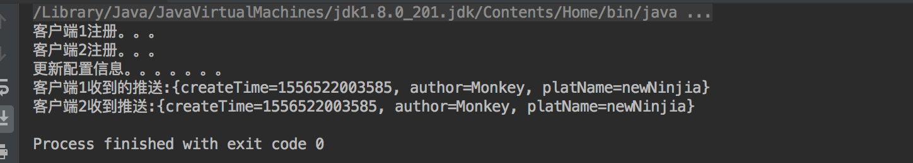

## 应用场景
观察者模式的应用场景也是挺典型的,比较好理解.我们日常生活中的很多应用场景也是变化驱动的.比如我们订阅了一个公众号,如果公众号的所有者发文章了微信会给我们发推送,工资到账了银行会给我们发推送.再比如我们做web前端开发的时候,会对按钮绑定一些特定的事件,用户触发之后执行相应的代码逻辑.这种绑定--变化--推送的过程就是一个观察者的典型的应用场景.
## 举例
举一个开发中的例子进行简单的模拟,Zookeeper,一个分布式的程序协调服务,在开发微服务的过程中用到过.可以用来做配置中心.比如我们开发了10个服务,全部都依赖相同的配置信息(比如存储信息/域名信息等),如果每个服务都维护一份的话一方面会产生很大冗余,另一方面如果配置有修改的话服务并不知道,所以会产生数据不同步的问题.面对这种情况,我们可以采用Zookeepr作为配置中心,将所有配置都加载到Zk集群中,所有服务对Zk集群进行监听,如果发生变化的话,ZK推送到每一个监听自己的服务,完成配置信息的更新.
## 实现
OK,针对上面的功能,我们就动手来实现一下.首先我们有个抽象接口,来表示观察者(ZK客户端),里面有个updateconfig方法,用来供被观察者调用:


package com.crazymonkey.observer;

import java.util.Map;
//观察者类
public interface Observer {

    //更新具体配置信息
    void updateConfig(Map<String,Object> cofing);

}



package com.crazymonkey.observer;

//被观察者接口
public interface Observable {

    //注册观察者
    void registerObserver(Observer observer);

    //移除观察者
    void removeObserver(Observer observer);

    //发送通知
    void notifyObserver();

}
}



package com.crazymonkey.observer;

import java.util.ArrayList;
import java.util.HashMap;
import java.util.List;
import java.util.Map;

public class ZKServer implements Observable {

    List<Observer> observerList = new ArrayList<>();

    Map<String,Object> config = new HashMap<>();

    public void setConfig(Map<String, Object> config) {
        this.config = config;
    }

    @Override
    public void registerObserver(Observer observer) {
        if(!observerList.contains(observer)){
           observerList.add(observer);
        }
    }

    @Override
    public void removeObserver(Observer observer) {
        if(!observerList.contains(observer)){
            observerList.remove(observer);
        }
    }
    
    @Override
    public void notifyObserver() {
        for (Observer observer:observerList) {
            observer.updateConfig(config);
        }
    }
}




package com.crazymonkey.observer;

import java.util.HashMap;
import java.util.Map;

public class TestObserver {

    public static void main(String[] args) {
        //模拟从配置文件或者数据库读取的配置信息
        Map<String,Object> config = new HashMap<>();
        config.put("createTime",System.currentTimeMillis());
        config.put("platName","Ninjia");
        ZKServer zkServer = new ZKServer();
        zkServer.setConfig(config);
        System.out.println("客户端1注册。。。");
        zkServer.registerObserver((map)-> {
            System.out.println("客户端1收到的推送:"+map);
        });
        System.out.println("客户端2注册。。。");
        zkServer.registerObserver((map)->{
            System.out.println("客户端2收到推送:"+map);
        });
        System.out.println("更新配置信息。。。。。。。");
        config.put("platName","newNinjia");
        config.put("author","Monkey");
        zkServer.setConfig(config);

    }
}

看一眼运行结果

## 总结
其实简单的观察者模式并没有什么特别难懂的地方,应用场景比较固定,所以相应的解决方案也比较固定.Server拿到了各个Observer,由于所有的Observer都实现相同的接口,所以他们有相同的行为,因此这也是一种面向接口编程的方式,屏蔽了底层的实现细节.本文只是对观察者模式的应用进行简单的说明,理解精髓即可,实际ZK的Watcher机制会比较复杂一些.
