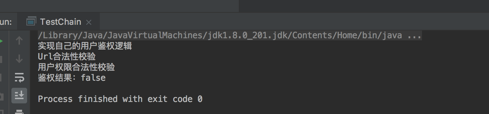

## 应用场景
责任链模式,从名字也可以看出来,责任的链条,突出的两个特点:职责的**分离**与**动态组合**.比如我们请假的审批流,从下到上每个领导都会对请求进行处理(通过或驳回),因为各个领导的职责是分离的,这时候我们在整个链条上进行增加或拆解也会变得很容易.再比如在讲模板方法模式的时候提到的鉴权的应用场景,也可以用责任链来处理.重新看一下场景:假设现在我们要处理一个用户的登录请求,需要对用户进行身份校验->url地址校验->用户权限校验三步,校验成功的才可以访问到业务接口.Ok,现在我们用责任链的思想来实现一下这个应用场景.
## 实现1
首先我们需要一个请求类,这个类是我们整个责任链处理的对象:
 
package com.crazymonkey.chain;

//模拟请求类
public class Request {

    private String userId;

    private String requestUrl;

    public Request(String userId, String requestUrl) {
        this.userId = userId;
        this.requestUrl = requestUrl;
    }

    public String getUserId() {
        return userId;
    }

    public void setUserId(String userId) {
        this.userId = userId;
    }

    public String getRequestUrl() {
        return requestUrl;
    }

    public void setRequestUrl(String requestUrl) {
        this.requestUrl = requestUrl;
    }
}
 
然后将职责的处理类进行抽象:
 
	package com.crazymonkey.chain;

	//鉴权接口的抽象
	public abstract class AuthHandler {

	    //持有后继节点的引用
	    protected AuthHandler next;

	    AuthHandler(AuthHandler next){
	        this.next=next;
	    }
	    //鉴权接口
	    abstract  boolean isLegal(Request request);

	}
 
责任链上的所有节点都有一致的鉴权行为,只不过每个节点的鉴权方式不一样,**行为一致,方式不同**这也是所有设计模式通用的应用场景.扯远了,来看一下具体的鉴权实现类:


	package com.crazymonkey.chain;
	//校验用户是否合法
	public class UserLegalHandler extends  AuthHandler{

	    public UserLegalHandler(AuthHandler next) {
	        super(next);
	    }

	    @Override
	    boolean isLegal(Request request)  {
	        boolean isUserLegal = false;
	        System.out.println("实现自己的用户鉴权逻辑 ");
	        isUserLegal=true;
	        return isUserLegal?(this.next==null?isUserLegal:next.isLegal(request)):isUserLegal;
	    }
	}
 

 
	package com.crazymonkey.chain;

	public class UrlLegalHandler extends AuthHandler {

	    public UrlLegalHandler(AuthHandler next) {
	        super(next);
	    }

	    @Override
	    boolean isLegal(Request request) {
	        System.out.println("Url合法性校验");
	        boolean isUrlLeagal = false;
	        return isUrlLeagal?(this.next==null?isUrlLeagal:next.isLegal(request)):isUrlLeagal;
	    }
	}
 


	package com.crazymonkey.chain;

	public class UserAuthenticatedHandler extends AuthHandler {

	    public UserAuthenticatedHandler(AuthHandler next) {
	        super(next);
	    }
	    @Override
	    boolean isLegal(Request request) {
	        System.out.println(" 用户权限合法性校验");
	        boolean isLeagal = false;
	        return isLeagal ? (this.next == null ? isLeagal : next.isLegal(request)) : isLeagal;
	    }
	}
 
可以看到,我们将鉴权的三个步骤分离到三个类中,三个类拥有共同的行为,并且构造的时候就获得了一个后继的引用,next就像指针一样,指向下一个节点,这样一个个的节点就向链条一样穿起来了,我们看下调用的方式:


	package com.crazymonkey.chain;
	public class TestChain {
	    public static void main(String[] args) {
	        boolean isAuth = new UserLegalHandler(new UrlLegalHandler(new UserAuthenticatedHandler(null))).isLegal(new Request("111","222"));
	        System.out.println("鉴权结果："+isAuth);
	    }
	}

 
看下结果:

## 分析
再回到我们文章开头提到的两个关键词**职责分离**,**动态组合**,假如这时候我们想在Url校验节点的后面增加签名校验怎么办呢?创建一个SignatureCheckHandler类继承AuthHandler,实现签名校验逻辑,然后在调用的时候把这个对象加到UrlLegalHandler后面即可,对现有的功能不造成影响.
## 实现2
我们现在已经了解了责任链的基本思想和用法,上面那种实现可以解决责任链相对固定的应用场景,因为我们是在代码中手动指定的后继节点.那么我们思考一下,能不能通过配置文件的方式来配置各个节点,并且使责任链的应用场景不局限于鉴权呢?答案当然是可以的,我们来看下实现:
首先我们定一个责任链类,用来控制整个责任链的职责流转,这个责任链缓存了该链条上的所有节点

package com.crazymonkey.chain2;

import com.crazymonkey.chain.Request;
import java.util.ArrayList;
import java.util.List;
public class Chain {
    //游标 用来标识当前处于哪个节点
    private int cursor;
    //存储所有的节点
    public List<Handler> handlers=new ArrayList<>();

    public void addHandler(Handler handler){
        this.handlers.add(handler);
    }

    public boolean execute(Request request){
        if(cursor<handlers.size()){
           return handlers.get(cursor++) .handle(request,this);
        }else {
            System.out.println("责任链执行完毕。。。");
            return true;
        }
    }
}
 

链条中存储的Handler接口很简单,只有一个handle方法

package com.crazymonkey.chain2;

import com.crazymonkey.chain.Request;

/**
 * 所有责任节点的接口
 */
public interface Handler {

    boolean handle(Request request,Chain chain);

}
 

OK,现在我们可以定义具体的handler了:


package com.crazymonkey.chain2;

import com.crazymonkey.chain.Request;

public class UserLegalHandler  implements Handler{

    @Override
    public boolean handle(Request request, Chain chain) {

        System.out.println("用户鉴权逻辑");
        boolean isLegal = true;
        if(isLegal){
            return  chain.execute(request);
        }else{
            return false;
        }
    }
}



package com.crazymonkey.chain2;

import com.crazymonkey.chain.Request;

public class UrlLegalHandler implements Handler {

    @Override
    public boolean handle(Request request, Chain chain) {
        System.out.println("URL合法性校验");
        boolean isLegal = true;
        if(isLegal){
            return  chain.execute(request);
        }else{
            return false;
        }
    }
}



package com.crazymonkey.chain2;

import com.crazymonkey.chain.Request;

public class UserAuthenticatedHandler implements Handler {

    @Override
    public boolean handle(Request request, Chain chain) {
        System.out.println("用户权限合法性校验");
        boolean isLegal = true;
        if(isLegal){
            return  chain.execute(request);
        }else{
            return false;
        }
    }
}



package com.crazymonkey.chain2;

import com.crazymonkey.chain.Request;

public class TestChain {
    public static void main(String[] args) {
        Chain chain = new Chain();
        chain.addHandler(new UserLegalHandler());
        chain.addHandler(new UrlLegalHandler());
        chain.addHandler(new UserAuthenticatedHandler());
        System.out.println("鉴权结果："+chain.execute(new Request("111","222"))); ;
    }
}

## 分析
运行结果就不贴了.经过上面的过程,和实现1相比,我们已经不需要为具体的handler实现类指定next节点了,从这个角度上讲我们已经实现了责任链的创建和具体的handler的分离,现在如果想要改成配置文件的方式就很简单了吧,我们可以自己定义数据格式,自己解析,通过反射机制来生成对象.嗯?这个模式好像有些眼熟....java web里面的filter就是这么搞的吧,我们在web.xml里定义filter节点,在访问servlet的时候,就可以经过我们定义好的FilterChain进行过滤.我们这个例子就是对filter的实现原理略加改造得到的,有兴趣的同学可以自己看一下filterchain的源码研究一下.
## 总结
我们举了两个例子来说明责任链这种设计模式,归根到底,也是为了实现职责分离和松耦合的代码组织方式,实现一里为什么不同的节点可以以next形式串联起来,因为next类型是抽象类,而不是具体类.这还是面向抽象编程实现高可扩展性的一种实践.
