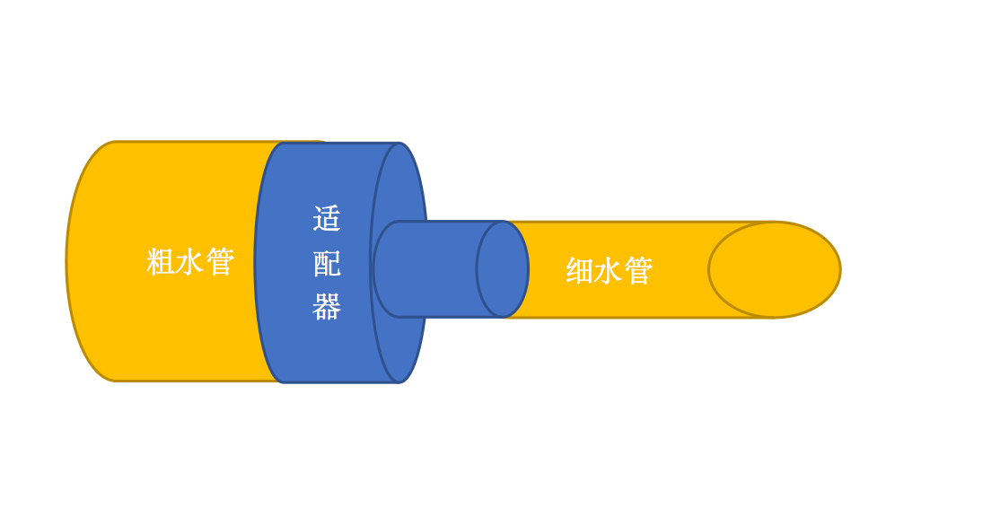

## 简介
先来看一张图

不同的生产厂商生产的东西规格有可能不一样,如果一个粗的水管和一个细的水管之间要联通且保证不漏水的话,就需要一个适配器将粗细两根管子连起来.这个适配器既有粗管子的特征又有细管子的特征.我们日常生活中用的各种转接头,插座其实都是适配器的思想.
## 应用场景
举一个实际开发中的例子,在java后端开发中,往往都涉及分层的思想,尤其是稍微大点的项目,分层设计可以使项目结构更加清晰,每一层也可以更加专注于本身的功能.比如常用的分层方式就是表示层-业务逻辑层-持久化层-DB,分别负责参数解析与封装-业务逻辑处理-持久化存储的功能,理想情况下各层职责清晰,并且可以做到很容易的替换,比如我的表示层只需要接收业务逻辑层返回的数据,不用关心实现方式,我的持久化层也只关注存储结果,而不用关心DB具体是MONGODB还是Mysql.这样一来我们在设计的时候就需要考虑代码的可扩展性.我们拿一个最简单的查工资的应用场景来说,首先定义一个工资查询的接口用来处理我们service层的业务逻辑:

package com.crazymonkey.adapter;

public interface SalaryService {

    //获取工资总数
    String getSalaryByUserId(String userId);

    //按月获取工资
    String getSalaryByMonth(String userId,int month);

    //是否发了年终奖
    String isYearEndBonus(String year);

}



package com.crazymonkey.adapter;

public class SalaryServiceImpl  implements  SalaryService{

    @Override
    public String getSalaryByUserId(String userId) {
        System.out.println("调用DAO层代码查询。。。");
        return "100W";
    }

    @Override
    public String getSalaryByMonth(String userId, int month) {
        System.out.println("调用DAO层代码查询。。。");
        return "50W";
    }

    @Override
    public String isYearEndBonus(String year) {
        System.out.println("调用DAO层代码查询。。。");
        return "yes";
    }
}



package com.crazymonkey.adapter;

public class SalaryController {

    public static void main(String[] args) {
        SalaryService service = new SalaryServiceImpl();
        service.getSalaryByMonth("111",2);
        service.getSalaryByUserId("111");
        service.isYearEndBonus("2019");
    }
}


我们通过这个Controller类来模拟真正的web请求来完善这个调用链条,虽然是模拟的,但是我们可以看到 controller-service-dao的调用关系.这个基本的思想有了,现在新需求来了--->老板觉得工资这个东西比较敏感,交给外人来维护比较好一些,所以就把工资计算和维护这块的业务单独拿了出去,交给老板的小舅子开的一个外包公司来做,外包公司提供独立的服务和sdk,来获取他们那边的数据,注意他们比较牛逼,只提供sdk,数据格式什么的也是他们定,假设他们提供的SDK入口类长这样:

package com.crazymonkey.adapter;

public class SalaryQuerySDK {
    
    String querySalaryByUserIdandMonth(String userId,int month){
        System.out.println("老板的小舅子公司提供的查询方式，包含加密，签名什么的。。。");
        return "result";
    }
}

## 修改
首先明确一点,需求变更很正常,不要抵触.我们应该着眼于自己的代码,让他去动态适应这种需求的变更.我们分析一下这个问题,工资的查询方式变了,属于service 层的变化,我们理想的情况是封装变化,且让变化对表示层透明,因此我们不能修改表示层的代码.第二,service层是我们自己的实现逻辑,如果修改了的话万一老板小舅子的公司倒闭了,要重新用回自己的逻辑呢?或者老板有个小姨子也要接进来呢,考虑到这些情况,修改我们自己的service层代码是很愚蠢的行为.既不能改自己的service,又不能改自己的表示层,那么我们就需要重建一个类,既有原先service层的特性,又有新的SDK的特性,来对二者实现适配,那么一个适配器应运而生:

package com.crazymonkey.adapter;

public class SalaryServiceAdapeter extends SalaryQuerySDK implements SalaryService {
    @Override
    public String getSalaryByUserId(String userId) {
        String result  = this.querySalaryByUserIdandMonth(userId,-1);
        System.out.println("解析result。。。");
        return "serviceresult";
    }

    @Override
    public String getSalaryByMonth(String userId, int month) {
        String result  = this.querySalaryByUserIdandMonth(userId,month);
        System.out.println("解析result。。。");
        return "serviceresult";
    }

    @Override
    public String isYearEndBonus(String year) {
        String result  = this.querySalaryByUserIdandMonth("",-1);
        System.out.println("解析result。。。");
        return "serviceresult";
    }
}

调用者:

package com.crazymonkey.adapter;
public class SalaryController {

    public static void main(String[] args) {
      //  SalaryService service = new SalaryServiceImpl();
      //只修改了这里一处
        SalaryService service = new SalaryServiceAdapeter();
        service.getSalaryByMonth("111",2);
        service.getSalaryByUserId("111");
        service.isYearEndBonus("2019");
    }
}

由于我们的controller是面向Salaryservice接口编程的,因此将原来我们自己的service,替换成小舅子适配器,仅仅需要改一行代码就ok了,如果采用了一些其他的ioc框架或者spi机制的话,都不用改代码了,这就彻底实现了解耦.
## 总结
这个例子中的适配器同时继承了SDK,并且实现了原有的service接口,是为了着重表示该适配器同时拥有二者的特点,其实这个例子可以不采用继承的方式,**采用组合的方式**由adapter拿到sdk的引用会更好,可扩展性也会更强.因为java的单继承机制,如果考虑到后期数据来源很多的情况下,继承实际上是满足不了需求的,采用组合灵活性更高.这个例子中我是对service进行的扩展,如果原有的service层逻辑很复杂的话,完全可以对dao层进行适配,将sdk提供的数据作为DAO层的数据来源.扩展哪一层无所谓,重点是掌握思想.
